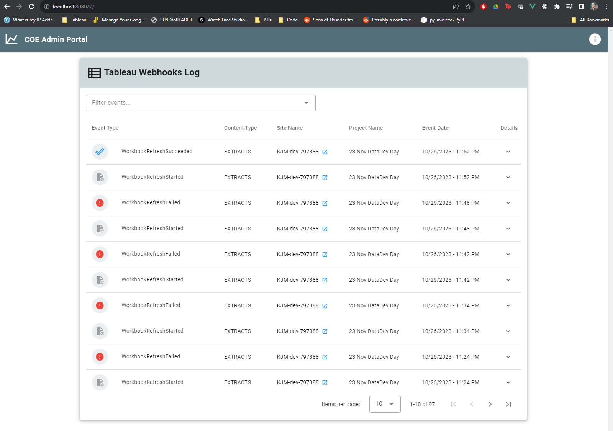

### DataDev Day November 2023
# Tableau Webhooks + AWS Lambda
##### Kyle Massey | *Twitter/X*: @UpInYourVizness | *github*: @kjmassey
---

# Event Logger Frontend
- Vue.js + Vuetify
- [Click here](https://github.com/kjmassey/django-tableau-webhooks) for backend source

### Installation
##### NOTE: Exact cli/terminal syntax may vary by OS
1. Clone this repo
2. In a terminal, navigate to root repo directory
3. Run *npm install*

### Starting the frontend
1. Run: *npm run server*
2. Visit [http://localhost:8080](http://localhost:8080)
3. If you see the page below, everything went swimmingly!
   


---
---
###### These are boilerplate commands included with every Vue.js project
# vue-webhook-ui

## Project setup
```
npm install
```

### Compiles and hot-reloads for development
```
npm run serve
```

### Compiles and minifies for production
```
npm run build
```

### Lints and fixes files
```
npm run lint
```

### Customize configuration
See [Configuration Reference](https://cli.vuejs.org/config/).
